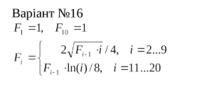
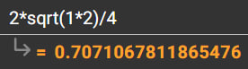
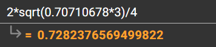
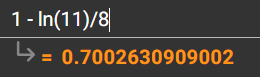

<p align="center"><b>МОНУ НТУУ КПІ ім. Ігоря Сікорського ФПМ СПіСКС</b></p>
<p align="center">
<b>Розрахунково-графічна робота
</b>


</p>
<p align="right"><b>Студент(-ка)</b>: Міндер Вадим Юрійович КВ-22</p>
<p align="right"><b>Рік</b>: 2026</p>

## Загальне завдання
1. Реалізувати програму для обчислення функції згідно варіанту мовою Common Lisp.
Варіант обирається згідно списку варіантів для лабораторних робіт за модулем 16:
1 -> 1, 2 -> 2, ..., 17 -> 1, 18 -> 2 і т.д.
2. Виконати тестування реалізованої програми.
3. Порівняти результати роботи програми мовою Common Lisp с розрахунками
іншими засобами.
## Варіант <16>


## Лістинг реалізації завдання
```lisp
(defun compute-f ()
  (let ((f (make-array 21)))
    (setf (aref f 1) 1.0)
    (setf (aref f 10) 1.0)

    ;; F_2 ... F_9
    (loop for i from 2 to 9 do
          (setf (aref f i)
                (/ (* 2 (sqrt (* (aref f (- i 1)) i))) 4)))

    ;; F_11 ... F_20
    (loop for i from 11 to 20 do
          (setf (aref f i)
                (- (aref f (- i 1))
                   (/ (log i) 8))))

    f))
```
### Тестові набори та утиліти
```lisp
(defun print-f ()
  (let ((f (compute-f)))
    (loop for i from 1 to 20 do
          (format t "F(~d) = ~f~%" i (aref f i)))))
```
### Тестування
```lisp
* (print-f)
F(1) = 1.0
F(2) = 0.70710677
F(3) = 0.7282376
F(4) = 0.8533684
F(5) = 1.0328168
F(6) = 1.2446787
F(7) = 1.4758685
F(8) = 1.7180619
F(9) = 1.9661229
F(10) = 1.0
F(11) = 0.7002631
F(12) = 0.38964975
F(13) = 0.06903109
F(14) = -0.2608511
F(15) = -0.59935737
F(16) = -0.94593096
F(17) = -1.3000827
F(18) = -1.6613791
F(19) = -2.029434
F(20) = -2.4039006
NIL
*
```

### Порівняння результатів з обчисленням іншими програмними засобами
Для F(2):



Для F(3):



Для F(11):


